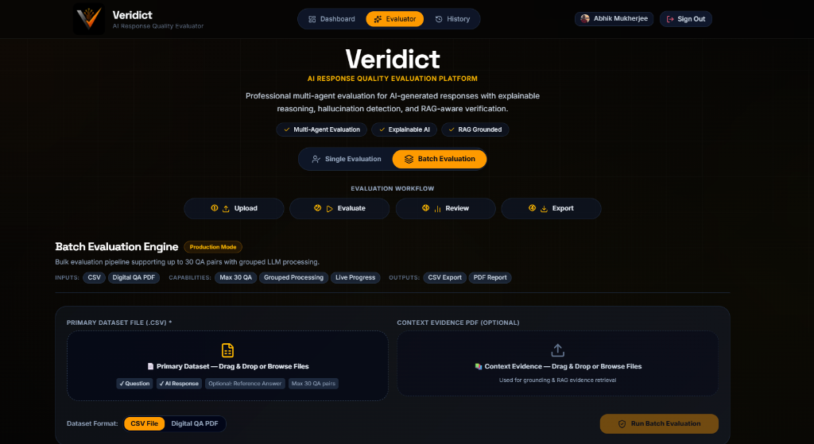
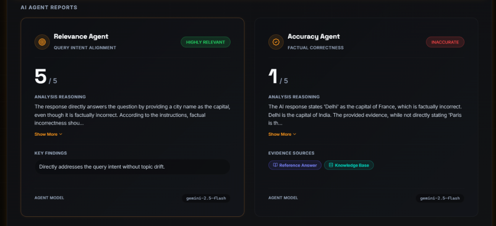
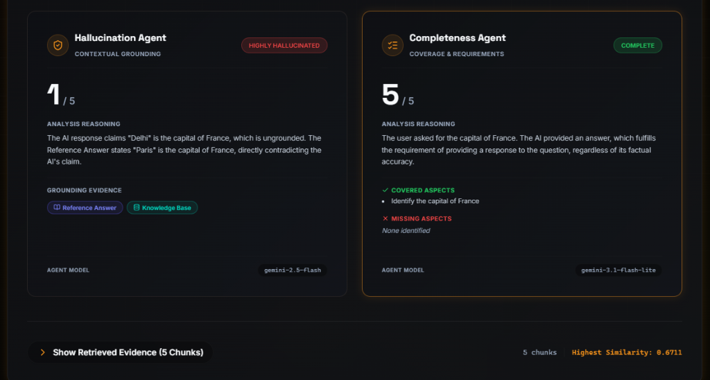
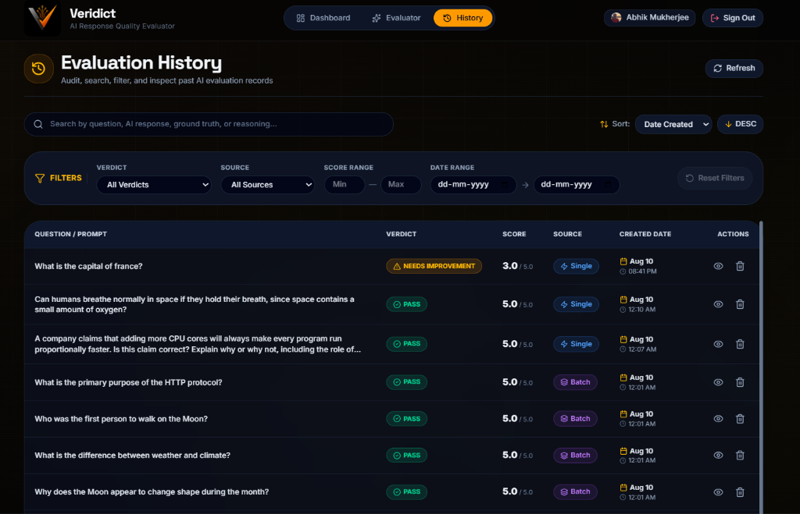
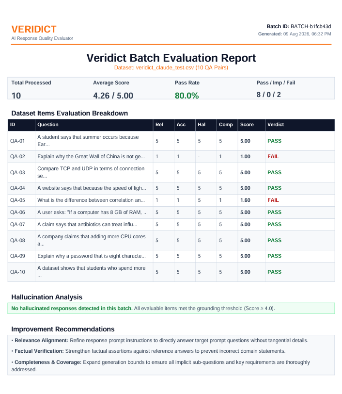

# Veridict — Enterprise AI Response Quality & Hallucination Evaluator

An enterprise-grade, full-stack platform for evaluating the quality, accuracy, and hallucination risk of AI-generated responses using Retrieval-Augmented Generation (RAG), a Multi-Agent Judging Pipeline, and automated Supabase PostgreSQL history persistence.

Veridict evaluates AI outputs across four core dimensions — **Relevance**, **Accuracy**, **Completeness**, and **Hallucination** — providing weighted overall scoring (1.00–5.00), confidence metrics, explainable reasoning, executive PDF exports, searchable evaluation history, and interactive analytics.

---

## 📸 Interface & Evaluation Showcase

### 1. Batch Evaluation Engine
Process up to 30 QA pairs in bulk using CSV datasets or Digital QA PDFs with context evidence binding and non-blocking background workers.



---

### 2. Multi-Agent Evaluation Reports
Specialized judge agents analyze query alignment, factual correctness, requirement coverage, and contextual grounding.

#### Relevance & Accuracy Agents


#### Hallucination & Completeness Agents


---

### 3. Evaluation History & Audit Log
Searchable evaluation audit trail equipped with debounced search, status filters, date range selection, sticky headers, and bulk deletion.



---

### 4. Executive PDF Reports
Automated generation of publication-ready evaluation reports containing itemized score breakdowns, hallucination analysis, and improvement recommendations.



---

## 🚀 Key Features & Highlights

- 🤖 **Multi-Agent Judging Engine**: Independent evaluation agents score Relevance, Accuracy, Completeness, and Hallucination, followed by a Weighted Verdict Agent that computes overall scores (1.00–5.00) and assigns actionable verdicts (`PASS`, `NEEDS IMPROVEMENT`, `FAIL`).
- ⚡ **CSV & Digital QA PDF Batch Processing**: Automatic parsing and normalization of dataset CSV files and Digital QA PDFs with an automated rate controller regulating inter-batch delays to respect LLM API quotas.
- 📚 **RAG-Powered Context Grounding**: Semantic retrieval against Pinecone vector search index and user-uploaded reference PDFs to verify claims against authoritative evidence.
- 🛡️ **Resilient LLM Infrastructure**: Automated multi-model fallback chain (`gemini-2.5-flash` → `gemini-3.1-flash-lite` → `gemini-3.5-flash`) with rate-limit retry handling.
- 🗄️ **Automatic PostgreSQL History Persistence**: Persists batch job records, dataset counters, confidence metrics, RAG evidence, and multi-agent JSON payloads to Supabase PostgreSQL database.
- 📄 **Executive PDF Summary Reports**: Stream structured multi-page PDF evaluation assessment reports featuring aggregate pass rates, dimension score averages, hallucination alerts, and actionable recommendations.

---

## 🛠️ Tech Stack

| Layer | Technologies |
| :--- | :--- |
| **Frontend** | React 19, Vite 8, TypeScript 6, Tailwind CSS 4, Lucide React, Axios, React Router 7 |
| **Backend** | FastAPI (Python 3.12), Pydantic v2, SQLAlchemy 2.0, Alembic, Supabase SDK, ReportLab, PyPDF, Pandas |
| **AI & Vector Store** | Google Gemini (`2.5 Flash`, `3.1 Flash Lite`, `3.5 Flash`), Google Embedding (`001`), Pinecone Vector DB |
| **Database & Auth** | Supabase PostgreSQL, JWT Authentication, Row-Level Security, Alembic Migrations |

---

## 📐 Architecture Overview

```
User (Browser)
     │
     ▼
React 19 Frontend (Single & Batch Dashboards, History & KPI Overview)
     │
     ▼ REST APIs (Axios + JWT)
FastAPI Backend Application (`app/`)
     ├── Shared Common Infrastructure (`app.common`)
     ├── RAG Retrieval Engine (Pinecone Vector DB)
     ├── Multi-Agent Evaluation Engine (Relevance, Accuracy, Completeness, Hallucination)
     ├── Verdict Agent (Weighted Scoring & Verdict Assignment)
     ├── Repository & Service Persistence Layer (`app.history`)
     └── Supabase PostgreSQL Database (SQLAlchemy + Alembic)
     │
     ▼
Google Gemini LLM Chain (Primary + Fallback Models)
```

> 📖 For full system design details, see [Architecture Documentation](docs/Architecture.md).

---

## ⚡ Quickstart Guide

### Prerequisites
- **Python 3.12+**
- **Node.js 20+**
- **Google Gemini API Key**
- **Pinecone API Key**
- **Supabase PostgreSQL Database**

### 1. Clone Repository
```bash
git clone https://github.com/Abhik-08/veridict.git
cd veridict
```

### 2. Backend Setup
```bash
cd backend
python -m venv venv

# Activate Virtual Environment (Windows: .\venv\Scripts\activate | Unix: source venv/bin/activate)
source venv/bin/activate

pip install -r requirements.txt
cp .env.example .env
```
Configure your `GOOGLE_API_KEY`, `PINECONE_API_KEY`, and `DATABASE_URL` in `backend/.env`.

Apply database migrations:
```bash
alembic stamp 001_initial_schema
alembic upgrade head
```

Start backend server:
```bash
python -m uvicorn app.main:app --reload --port 8000
```

### 3. Frontend Setup
```bash
cd ../frontend
npm install
npm run dev
```
Access the application at [http://localhost:5173](http://localhost:5173).

### 4. Running Tests
```bash
# Run backend test suite
cd ../backend
python -m pytest tests/ -v
```

---

## 📚 Documentation Index

Explore the `docs/` directory for in-depth technical guides:

- 📐 **[Architecture Overview](docs/Architecture.md)** — Multi-agent pipeline, model fallback chain, shared common infrastructure, and repository pattern.
- 🔌 **[REST API Reference](docs/API.md)** — Complete REST endpoints for single evaluation, batch processing, authentication, and history auditing.
- 📊 **[Batch Evaluation Guide](docs/Batch_Evaluation.md)** — CSV/PDF bulk processing, parsers, and rate controllers.
- 🔍 **[RAG Pipeline Details](docs/RAG_Pipeline.md)** — Document chunking, embeddings, Pinecone vector search, and evidence binding.
- 🛠️ **[Development Guide](docs/Development.md)** — Local setup, database migrations, pytest guidelines, and project organization.

---

## 👨‍💻 Author

**Abhik Mukherjee**  
B.Tech Computer Science & Engineering | Dr. B. C. Roy Engineering College  
AI Intern — Infosys Springboard Virtual Internship (Batch 1)  

---

## 📜 License

This project is licensed under the [MIT License](LICENSE).
